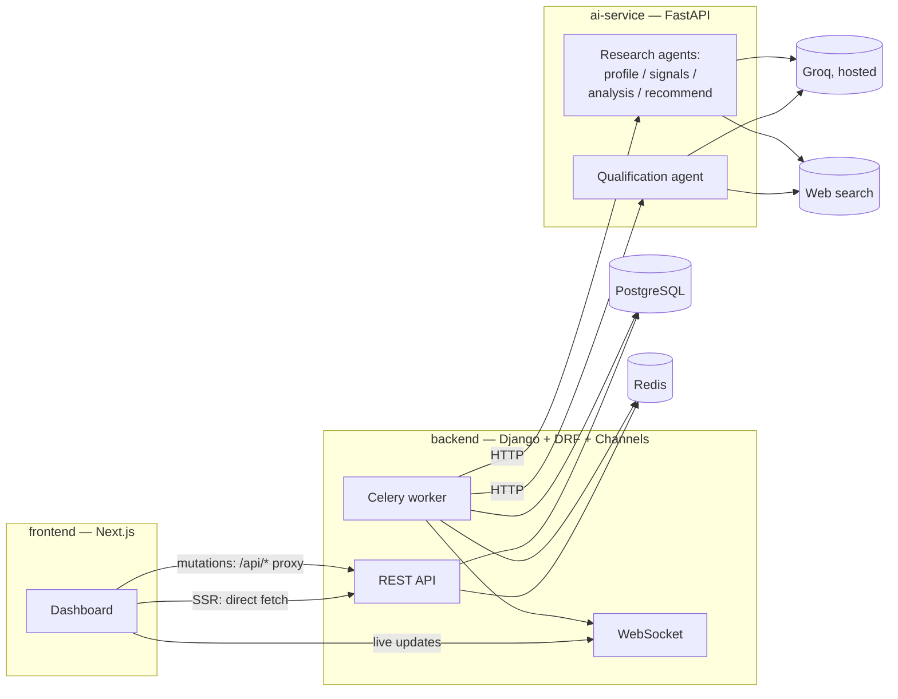

# Vantage — AI B2B Growth Intelligence Platform

An AI B2B growth intelligence platform: **research any company, find what
changed recently, judge the fit, and draft the next step — showing the sources
behind every claim.**

Built on a hosted LLM API (Groq, free tier — see §2), with web search the model
can call, Next.js, the AI layer split into its own FastAPI microservice, and
Celery + Redis + WebSockets.

There are two ways in. The public one needs no account:

```
                        ┌─────────────────────────────┐
  "stripe.com" ────────►│  1  profile   (+ search)    │
  (public, no login)    │  2  signals   (+ search)    │  ← each a bounded
                        │  3  analysis  (+ search)    │    call to Groq
                        │  4  ICP score (Django)      │  ← deterministic
                        │  5  recommendation          │
                        └──────────────┬──────────────┘
                                       ▼
                   evidence-backed brief + cited sources


  Lead in → Django API → Celery → AI service → Groq (+ web search)
                ↓                                        ↓
           Postgres ←──────── score + qualification ─────┘
                ↓
     WebSocket broadcast → dashboard (live, no polling)
```

Research is five steps rather than one call for four reasons: each gets its own
timeout instead of sharing a cumulative one; the public progress bar reports
*measured* step boundaries rather than a staged animation; step 4 is genuinely
deterministic Python; and splitting an agent into its own service later becomes
a copy rather than a refactor.

---

## 1. Why three separate services



**backend/** (Django) owns the data model, auth, routing rules, and the
Celery task that orchestrates a qualification. It's the one place business
logic like "what counts as high-intent" lives.

**ai-service/** (FastAPI) owns *only* the AI call: talking to the hosted
model, deciding whether to use the web-search tool, and returning a
structured result. Nothing in here knows what a "Lead" model looks like in
Django — it takes a flat payload in, returns a flat qualification out. That's
deliberate: you can change models, providers, or add new tools without
touching Django, and you can scale/restart this service independently since
it's the one doing slow I/O (model inference, web search).

**frontend/** (Next.js) never talks to Django directly from the browser for
anything that needs auth or mutates data — Server Components fetch from
Django over the internal Docker network at render time (fast, and the
backend's address never reaches client JS), and browser-side actions (login,
lead submission, re-qualify, assign) go through Next.js Route Handlers under
`app/api/*`, which do the authenticated call server-side. The one exception
is the WebSocket: browsers connect to Django Channels directly, because
proxying a persistent duplex connection through Next.js adds real fragility
for very little benefit in a V1.

This is also why Next.js over plain React: Server Components mean the
dashboard's *first paint* already has real data (no client-side loading
spinner + waterfall of fetches), and Route Handlers give you a server-side
place to hide the backend URL and attach auth without a separate BFF service.

---

## 2. Model choice: why `qwen/qwen3.8-27b` on Groq

This project originally ran a local model via Ollama. It now calls
[Groq](https://console.groq.com)'s hosted, OpenAI-compatible API instead — no
GPU, no multi-GB download, no host-machine dependency at all. `ai-service/app/main.py`
reads `GROQ_MODEL` from the environment — change it any time by editing
`ai-service/.env`, no code changes needed. The default is `qwen/qwen3.8-27b`
because Groq's free tier hosts it directly: no card required, 14,400
requests/day and 30/minute — comfortably enough for this app's volume,
including the scheduled monitoring/trend-scan tasks (see §7).

**One real trade-off from moving off a local model, stated plainly rather than
hidden**: Ollama's `format=` parameter guaranteed syntactically valid JSON at
the token level. Groq documents that same *guaranteed* mode as available only
for its own `gpt-oss-*` models — this model gets best-effort JSON, which
usually matches the schema but isn't guaranteed to. `agents/base.py`'s
existing one-shot repair retry (ask the model to fix its own malformed
response) is what actually covers this gap, and it was already needed for
occasional Ollama slip-ups too — it isn't new.

**If you want to try alternatives**, change `GROQ_MODEL` in `ai-service/.env`
(no rebuild needed, no download — the model just needs to exist on Groq's
account):

| Model | When to use it |
|---|---|
| `openai/gpt-oss-20b` | Same free tier, and Groq's *guaranteed*-valid-JSON mode is only available on this model family — trade the "Qwen" name for a hard reliability guarantee on structured output. |
| `openai/gpt-oss-120b` | Same guarantee, larger model, still on Groq's free tier at time of writing. |
| `qwen/qwen3.8-27b` | The default — see above. |

Two design choices keep a model swap cheap:

- **Scoring methodology is independent of the model.** `backend/leads/scoring.py`
  blends the model's self-reported confidence with hard-coded ICP rules, so
  changing models changes the quality of one input — not how leads are scored.
- **The model label is never hardcoded in the UI.** The dashboard's status rail
  reads it from `GET /health`, so it can't drift from what's actually running.

### A note on Qwen 3 specifically

Qwen 3 is a hybrid reasoning model and can still emit `<think>…</think>`
blocks. There's no request field on Groq's API to suppress this the way
Ollama's top-level `think: false` did, so `llm_client.py` strips any block
defensively instead — a stray one would otherwise break JSON parsing. Tool
results are also sent back with `name` and `tool_call_id`, which Qwen's chat
template expects, and `arguments` is translated between the JSON-string wire
format Groq's API actually returns and the parsed-dict shape this codebase's
call sites are written against (see `llm_client.py`'s `_normalize_outgoing`).

---

## 3. Web search

`ai-service/app/web_search.py` tries three providers, in order:

1. **Self-hosted SearXNG** (`docker-compose.yml`'s `searxng` service) — the
   default, no external account needed at all. Its JSON API is off by default
   upstream; `searxng/settings.yml` (baked into `searxng/Dockerfile` for
   deployment, bind-mounted for local dev) turns it on.
2. **Ollama's hosted web search API** (`ollama.web_search`), used only if
   `OLLAMA_API_KEY` is set in `ai-service/.env` — a free key from
   **Settings → API Keys** at ollama.com. Unrelated to the `GROQ_*` model
   config in §2; this is only ever a search provider, not the model.
3. **DuckDuckGo** (`ddgs`, no API key) as the last-resort fallback if both of
   the above are unavailable or error.

Search results are **not** flattened into prose. Each result keeps the query
that found it, the provider that answered, its rank and when it was fetched,
and is stored as a `Source` row — which is what makes the citations in §4
possible. Two failure modes are also kept distinct: "search returned nothing"
and "search itself broke" are different facts, and telling the model the
latter stops it concluding that a company doesn't exist.

To swap in a different paid provider (SerpAPI, Bing, Google CSE) later:
implement the same `search(query) -> SearchOutcome` signature as a third
branch in `_search_sync()`. Nothing else changes.

---

## 4. Evidence: why the system believes what it says

The point of the research pipeline is not a score, it's a score you can check.

```
ResearchJob ──> Source        a page actually fetched (url, query, provider, rank, time)
     │            ▲
     ├──> ResearchClaim ──────┘  an assertion, citing the pages behind it
     └──> Signal ─────────────┘  a dated event: funding, hiring, news
                │
                ▼
      CompanyIntelligence      the current synthesised view
```

Three rules keep this honest:

- **An unsourced claim is capped.** If the model asserts something and cites no
  page, it inferred it. Those are held at confidence ≤ 0.4 and rendered
  distinctly in the UI, so a guess can never outrank a fact.
- **Hallucinated citations are dropped, not trusted.** Models routinely cite
  `[9]` when shown six results. Out-of-range indices are discarded (and the
  drop rate logged) rather than attaching a claim to the wrong page.
- **Research confidence is computed, never asked for.** Ask a model how
  confident it is and you get a number it invented. It's derived from mean
  claim confidence scaled by source coverage, so it falls honestly when search
  finds little.

---

## 5. Real-time updates

`leads/tasks.py` broadcasts over Django Channels (backed by Redis) every time a
lead's status changes or qualification completes. `LiveProvider` holds **one**
WebSocket for the whole dashboard and fans events out to subscribers — submit a
lead in one tab and watch it score itself live in another.

Public research progress deliberately uses **polling**, not the WebSocket. The
socket is a single global authenticated broadcast group with no subscribe
protocol; teaching it to route per-job progress to anonymous visitors is a lot
of machinery for one two-minute job watched by one person. Polling also
survives a backend restart mid-job.

---

## 5. Design

The dashboard is an **original visual identity** — near-black navy surfaces in
four elevation steps, a violet accent reserved for AI-produced content and
primary actions, semantic status colours, and a Space Grotesk / Inter /
JetBrains Mono type system. It is not a clone of any specific company's site,
design assets, or branding. Single dark theme by design: no `dark:` variants
anywhere, so the tokens in `tailwind.config.ts` are simply *the* colours.

### Designing for sparse data

This is the part worth reading. The demo dataset is a dozen genuinely
AI-qualified leads, all created the same day — so there is no trend to draw and
nothing to compare against. Rather than fabricating history to make the charts
look busy, every surface has a truthful degraded state:

| Surface | With sparse data |
|---|---|
| Metric delta | `—` and "no prior period", never `+0%` |
| Sparkline | flat dashed baseline + "trend appears after 7 days", never a line through two points |
| Intent over time | empty state, but the single real point is *named* — omitting it is its own dishonesty |
| Top industries | below two industries the % bars are dropped (100% at n=1 is a tautology) |
| Engagement score | "Not tracked yet" — this product has no engagement data, so it shows none |
| Sources | "No public sources found", and every claim is then marked inferred |
| Requests meter | a bare count when no quota is configured, rather than a fake denominator |

`Sparkline` takes `hasEnoughHistory` as a **required** prop with no default, so
the compiler forces that decision at every call site rather than letting a
future caller quietly draw a misleading curve.

Fonts load via a `<link>` tag in `app/layout.tsx` rather than
`next/font/google`, deliberately — `next/font` fetches font files from
Google at Docker *build* time, which is a real fragility in CI/CD or
network-restricted build environments. Runtime loading means a blocked or
offline build still succeeds; `app/globals.css` defines solid system-font
fallbacks so the page still looks intentional even if a browser can't reach
Google Fonts either.

Fonts load via a `<link>` tag in `app/layout.tsx` rather than
`next/font/google`, deliberately — `next/font` fetches font files from
Google at Docker *build* time, which is a real fragility in CI/CD or
network-restricted build environments. Runtime loading means a blocked or
offline build still succeeds; `app/globals.css` defines solid system-font
fallbacks so the page still looks intentional even if a browser can't reach
Google Fonts either.

---

## 6. Project structure

```
vantage/
  backend/           Django + DRF + Channels + Celery
    config/           settings, urls, asgi (websocket routing), celery app
    leads/            Lead + Company models, scoring, qualification task,
                      companies.py (domain normalisation + dedupe)
    intelligence/     ResearchJob, Source, ResearchClaim, Signal,
                      CompanyIntelligence — the evidence layer;
                      research pipeline task, public API, throttling
    analytics/        summary, intent-over-time, industries, activity, insights
  ai-service/        FastAPI + Groq client + web search
    app/prompts/      icp.py is the single source of ICP truth (served at /icp)
    app/agents/       one module per research step; base.py holds the shared loop
  frontend/          Next.js 16 (App Router)
    app/(public)/     "/" landing + research, /research/[jobId] permalink
    app/(dashboard)/  everything under /dashboard — Server Components
    app/login/        standalone login
    app/api/          Route Handlers proxying to Django
    components/ui/    the primitive layer (Card, Badge, StatCard, GaugeRing…)
    components/       dashboard/, research/, shell/, providers/
  docker-compose.yml
  setup.sh
```

The dashboard lives under `/dashboard`, not `/`, specifically so the landing
page can be public: `proxy.ts` matches public routes with an *exact* set plus a
short prefix list, because a prefix match on `"/"` would make every path in the
app public and silently disable auth.

---

## 7. Quick start

**Prerequisites:** Docker + Docker Compose, and a free
[Groq API key](https://console.groq.com) (no card required). That's the whole
list — there's no local model to install or GPU to have, which is a real
simplification from when this ran against Ollama.

```bash
./setup.sh                                  # creates .env files from the examples
# edit ai-service/.env: set GROQ_API_KEY=<your key>
docker compose up --build

# in another terminal, once the backend is up:
docker compose exec backend python manage.py seed_demo_data
```

Seeding qualifies every lead through the real model, one at a time (never
concurrently — kept sequential to stay well under Groq's free-tier per-minute
rate limit and because an earlier version fired them in parallel against a
single-concurrency local backend and several timed out waiting behind each
other). Budget **~15 minutes**; it prints per-lead progress.

Open **http://localhost:3000** — the landing page is public, so you can research
a company without an account. Sign in with `demo` / `vantage-demo` for the
dashboard at **/dashboard**, or create your own account at **/register**.
Self-registered accounts are ordinary users, not staff, so they don't appear in
the lead-assignment roster — grant `is_staff` in Django admin for that.

- Frontend: http://localhost:3000
- Backend API: http://localhost:8000/api/
- Django admin: http://localhost:8000/admin/
- AI service docs (Swagger): http://localhost:8001/docs

### Change monitoring (off by default)

Once a company has been researched, Vantage can re-check its public pages on a
timer and only spend a full research run when something actually changed. The
check itself is page fetches and a hash — no model call unless the content
moved, and then one short classification call to decide whether the change
reads as a business event or as noise.

It is opt-in because it makes outbound requests to company websites on a
schedule. Set `MONITOR_ENABLED=true` in `backend/.env` and restart:

```sh
docker compose up -d --force-recreate beat monitor-worker
```

`MONITOR_BASE_INTERVAL_HOURS` (default 24) sets how soon a company is
re-checked; a company that keeps coming back unchanged backs off by doubling,
up to `MONITOR_MAX_INTERVAL_HOURS` (default 168). Each account's page shows
when it was last checked, or says plainly that it couldn't be.

Only companies with a `domain` or `website` on record can be checked — research
doesn't always capture one, and an account without it is reported as
unreachable rather than quietly counted as unchanged.

### Deploying

`render.yaml` provisions the backend, ai-service and SearXNG as Render web
services plus a free Postgres and Key Value (Render's free plan has no
background-worker option, so the Celery layer runs separately — see
`docker-compose.oracle.yml` and `oracle.env.example` for running it on a free
Oracle Cloud VM instead, pointed at Render's databases over their external
connection strings). The frontend deploys to Vercel natively, no extra config
beyond `BACKEND_INTERNAL_URL`/`NEXT_PUBLIC_WS_URL` pointed at the Render
backend's public URL — `NEXT_PUBLIC_WS_URL` is baked into the client bundle
at build time, so changing it later needs a redeploy, not just an env var edit.

---

## 8. Local dev without Docker (faster iteration)

```bash
# Postgres + Redis still easiest via Docker:
docker compose up postgres redis -d

# Backend
cd backend && python -m venv .venv && source .venv/bin/activate
pip install -r requirements.txt
cp .env.example .env   # edit POSTGRES_HOST=localhost, REDIS_URL=redis://localhost:6379/0
python manage.py migrate
python manage.py seed_demo_data
daphne -b 0.0.0.0 -p 8000 config.asgi:application
# in another terminal, same venv:
celery -A config worker -l info

# AI service
cd ai-service && python -m venv .venv && source .venv/bin/activate
pip install -r requirements.txt
cp .env.example .env   # set GROQ_API_KEY=<your key>
uvicorn app.main:app --reload --port 8001

# Frontend
cd frontend && npm install
cp .env.local.example .env.local   # BACKEND_INTERNAL_URL=http://localhost:8000
npm run dev
```

---

## 9. What's actually been verified

Each item below was exercised against the running stack, not assumed.

**Infrastructure**
- `docker compose up --build` from clean brings all eleven services up. The
  one-shot `migrate` service runs alone and exits 0; `backend` and every
  Celery-based service wait on it. This fixed a real race where `backend` and
  `celery-worker` — built from the same image — both ran `migrate` and
  intermittently died with a duplicate-key error on `pg_type`.
- `celery inspect active_queues` confirms `qualify-worker` consumes
  `qualify,celery` and `research-worker` consumes `research`, concurrency 1
  each. This is deliberate: an earlier run at `--concurrency=4` sent
  concurrent requests into a single-concurrency local model backend and
  produced a thundering herd that failed 4 of 5 leads. Staying
  single-concurrency now also keeps this app's own request rate comfortably
  under Groq's free-tier per-minute limit.

**Backend**
- `manage.py check` clean; `makemigrations --check` reports no drift.
- `leads/0003` applies forward, reverses to `0002`, and re-applies cleanly. Its
  data migration backfilled all existing company domains and merges duplicates
  *before* adding the unique constraint.
- `normalize_domain` verified against URLs with scheme/userinfo/port/path,
  trailing dots, emails, freemail hosts, bare IPs and plain company names.
- Public research: `POST /api/research/` → 202 with a UUID job and five pending
  steps; a repeat call while running returns the in-flight job; an empty query
  → 400.
- **Throttling verified end to end**: five requests → 202, the sixth → **429**,
  and a different `X-Forwarded-For` gets its own bucket. That last check matters
  most — every request reaches Django through the Next.js proxy, so keying on
  the socket peer would have throttled all visitors as one and the fifth
  research of the hour would have locked out everyone else.
- Failure path: with the AI service unreachable, the job ends `failed`, names the
  step that broke, leaves later steps `pending`, and records the real error.
- `check_icp_sync` passes, proving the backend's scoring constants still agree
  with the prompt spec the model is given.

**AI service**
- All seven routes registered; `/health` reports the configured model plus
  `model_available`, and `/icp` serves the shared spec.
- A missing model surfaces as a clear 502 rather than a silently zeroed result.

**Frontend**
- `tsc --noEmit` clean; `next build` compiles all 24 routes.
- **Auth matrix verified live, logged out and in.** Logged out: `/` → 200,
  `/login` → 200, and every `/dashboard/*` → 307 to login. Logged in: all
  dashboard routes → 200. The gate logic was additionally unit-checked against
  ten paths including `/dashboardfoo` (no prefix bleed).
- Exactly one `new WebSocket` call site remains (there were two, so every
  dashboard page previously held two connections and processed each message
  twice).
- No fabricated demo figures anywhere in the frontend — grepped and confirmed.

**Genuinely untested**, because the Groq swap in §2 was implemented and
compile/typecheck/local-health-check verified without a real `GROQ_API_KEY` —
no live call to Groq's API has actually been made in this environment:

- Whether Qwen3-32B's best-effort JSON mode on Groq holds up in practice, or
  leans on `agents/base.py`'s repair retry more often than the old
  guaranteed-valid-JSON path did. The one difference disclosed in §2 that
  hasn't been measured yet.
- Tool-calling round-trips (the qualification loop's `web_search` tool) against
  Groq's real API, including the JSON-string ↔ dict `arguments` translation in
  `llm_client.py`'s `_normalize_outgoing`. Structurally correct against Groq's
  documented API shape; not yet exercised against a live response.
- End-to-end research against live web results with the new provider, and
  therefore the seeded demo data in §7. If claims come back thin or uncited,
  check `docker compose logs ai-service` — the citation drop-rate is logged.

(The local-Ollama version of this pipeline — the same agent code, a different
`llm_client.py` implementation underneath — was extensively verified earlier
in this project's life: tool-calling, citation accuracy, and output quality
against real companies. That verification transfers to *this* codebase's
correctness, not to Groq's actual behavior, which is why the above is called
out separately.)

## 10. Where this sits vs. the original roadmap

This is V1 as scoped, with the architecture upgrades from this conversation
folded in from the start rather than left for V2: web search (was listed as
an AI Visibility/V2 idea) is here in a lighter form as a qualification tool,
and Celery/Redis/WebSockets (explicitly deferred in the original roadmap)
are load-bearing in V1 because they were requested up front. Still deferred,
per the original plan: real CRM integration, WhatsApp automation, and the
full standalone AI Visibility/AEO analyzer module.
